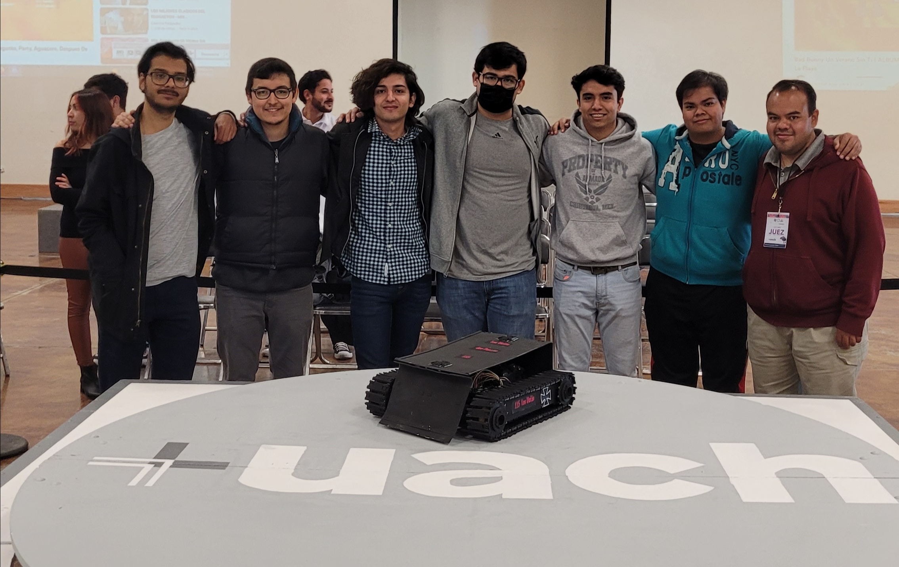

<h1>

  

</h1>

  <i align="center">"En el sector industrial, los robots escriben la historia de la ingeniería moderna."</i>

 

## Bienvenido al Club de Robotica

Este repositorio contiene información, materiales y registros del Club de Robótica de la Universidad Autonoma de Chihuahua semestre **Agosto - Diciembre 2023**.

## Liderazgo del Club

- **Encargado del Club y Laboratorio de Automatica:** Ing. Jesús Manuel Muñoz Larguero
- **Presidente del Club:** Jesús Alejandro Jiménez Hernández
- **Vicepresidente y Secretario del Club:** Oscar Alejandro Serrano Pizarro

## 📌 Índice

- [🤖 Contenido](#-contenido)
  - [🎯 Visión y Objetivos](#visión-y-objetivos)
  - [📬 Reclutamiento](#reclutamiento)
  - [📅 Reuniones y Horarios](#reuniones-y-horarios)
  - [📝 Planificación de Actividades](#planificación-de-actividades)
  - [👥 Miembros del Club](#miembros-del-club)
  - [🔧 Proyectos y Competencias](#proyectos-y-competencias)
  - [💬 Comunicación](#comunicación)
  - [🔄 Evaluación y Mejora Continua](#evaluación-y-mejora-continua)
- [🙌 Contribuciones](#-contribuciones)
- [📄 Licencia](#-licencia)

## 🤖 Contenido

### 🎯 Visión y Objetivos

**Fomentar la pasión por la robótica y la tecnología**, promoviendo la creatividad y el aprendizaje colaborativo. Nuestros objetivos incluyen:

- Aprender los fundamentos de la robótica.
- Desarrollar habilidades de programación y diseño.
- Mostrar las aplicaciones de la robótica en la industria.
- Participar en competencias y demostraciones.

### 📬 Reclutamiento

Para unirte al Club, envía un correo a la siguiente dirección [a338906@uach.mx](mailto:a338906@uach.mx), unete al grupo de [WhatsApp](https://chat.whatsapp.com/ECxJN3R8EFlGwHjqUFfpuz) o asiste al Laboratorio de Automática para obtener más información.

### 📅 Reuniones y Horarios

Nuestras sesiones se llevarán a cabo todos los viernes de 4:00 PM a 6:00 PM en el Laboratorio de Automática.

### 📝 Planificación de Actividades

Las siguientes fechas son tentativas y no finales, esto debido a que muchos alumnos en semestres anteriores se ausentan durante la semana de evaluaciones:

- **Semana 1:** Introducción a la robótica y presentación de los miembros.
- **Semana 2-3:** Electrónica y movimiento.
- **Semana 4-8:** Programación de robots utilizando Arduino.
- **Semana 8-12:** Elaboración del proyecto acordado en la primera semana.
- **Semana 12-16:** Preparación para la Competencia de Sumo Bot.

### 👥 Miembros del Club

> [!NOTE]  
> Los miembros del club deberan llenar esta seccion con sus datos (Nombre - Matricula - Direccion a su cuenta de GitHub).

### 🔧 Proyectos y Competencias

- **Proyecto 1:** Diseño y programación de un sistema automatizado (enfoque industrial).
- **Proyecto 2:** Diseño y programación de un brazo robótico (enfoque académico).
- **Competencia:** Sumo Bot.

### 💬 Comunicación

Las comunicaciones y avisos del club se realizarán a través del grupo de WhatsApp [Club de Robótica FING](https://chat.whatsapp.com/ECxJN3R8EFlGwHjqUFfpuz).

### 🔄 Evaluación y Mejora Continua

Al final del ciclo, realizaremos una encuesta para recopilar comentarios y sugerencias para futuras mejoras del club.

## 👏 Contribuciones

Para poder contribuir en este repositorio, es necesario formar parte del Club de Robótica. Al ser miembro, podrás agregar, modificar y editar contenido del repositorio.

## 📄 Licencia

La Licencia MIT es conocida por su flexibilidad y su enfoque en la colaboración y el intercambio de conocimientos. Al utilizar esta licencia, buscamos promover la reutilización y la contribución, permitiendo a los interesados participar en el aprendizaje y la exploración de la robótica de manera abierta y colaborativa.
