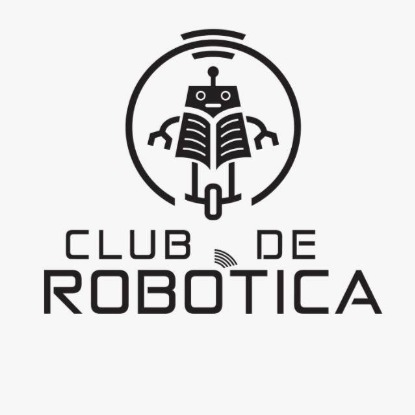

# Club de Robótica: Agosto - Noviembre 2023

---

## Índice

- [Contenido](#contenido)
  - [Visión y Objetivos](#visión-y-objetivos)
  - [Reclutamiento](#reclutamiento)
  - [Reuniones y Horarios](#reuniones-y-horarios)
  - [Planificación de Actividades](#planificación-de-actividades)
  - [Liderazgo y Roles](#liderazgo-y-roles)
  - [Proyectos y Competencias](#proyectos-y-competencias)
  - [Comunicación](#comunicación)
  - [Evaluación y Mejora Continua](#evaluación-y-mejora-continua)
- [Contribuciones](#contribuciones)
- [Licencia](#licencia)

---

## Visión y Objetivos

Fomentar la pasión por la robótica y la tecnología, promoviendo la creatividad y el aprendizaje colaborativo. Nuestros objetivos incluyen:

- Aprender los fundamentos de la robótica.
- Desarrollar habilidades de programación y diseño.
- Mostrar las aplicaciones de la robótica en la industria.
- Participar en competencias y demostraciones.

---

## Reclutamiento

Para unirte al Club, envía un correo a la siguiente dirección `a338906@uach.mx` o asiste al Laboratorio de Automática para obtener más información.

## Comunicación

Las comunicaciones y mensajes del club se realizarán a través del grupo de WhatsApp "Club de Robótica FING".

---

## Reuniones y Horarios

Nuestras sesiones se llevarán a cabo todos los viernes de 4:00 PM a 6:00 PM en el Laboratorio de Automática.

## Planificación de Actividades

- **Semana 1:** Introducción a la robótica y presentación de los miembros.
- **Semana 2-3:** Electrónica y movimiento.
- **Semana 4-8:** Programación de robots utilizando Arduino.
- **Semana 8-12:** Elaboración del proyecto acordado en la primera semana.
- **Semana 12-16:** Preparación para la Competencia de Sumo Bot.

---

## Liderazgo y Roles

- **Encargado:** Ing. Jesús Manuel Muñoz Larguero
- **Presidente:** Jesús Alejandro Jiménez Hernández
- **Vicepresidente:** Oscar Alejandro Serrano Pizarro

## Proyectos y Competencias

- **Proyecto 1:** Diseño y programación de un sistema automatizado (enfoque industrial).
- **Proyecto 2:** Diseño y programación de un brazo robótico (enfoque académico).
- **Competencia:** Sumo Bot.

---

## Evaluación y Mejora Continua

Al final del ciclo, realizaremos una encuesta para recopilar comentarios y sugerencias para futuras mejoras del club.

---

## Contribuciones

Para poder contribuir en este repositorio, es necesario formar parte del Club de Robótica. Al ser miembro, podrás agregar, modificar y editar contenido del repositorio.

---

## Licencia

La Licencia MIT es conocida por su flexibilidad y su enfoque en la colaboración y el intercambio de conocimientos. Al utilizar esta licencia, buscamos promover la reutilización y la contribución, permitiendo a los interesados participar en el aprendizaje y la exploración de la robótica de manera abierta y colaborativa.

---

## Índice

- [Contenido](#contenido)
  - [Visión y Objetivos](#visión-y-objetivos)
  - [Reclutamiento](#reclutamiento)
  - [Reuniones y Horarios](#reuniones-y-horarios)
  - [Planificación de Actividades](#planificación-de-actividades)
  - [Liderazgo y Roles](#liderazgo-y-roles)
  - [Proyectos y Competencias](#proyectos-y-competencias)
  - [Comunicación](#comunicación)
  - [Evaluación y Mejora Continua](#evaluación-y-mejora-continua)
- [Contribuciones](#contribuciones)
- [Licencia](#licencia)

---

## Visión y Objetivos

Fomentar la pasión por la robótica y la tecnología, promoviendo la creatividad y el aprendizaje colaborativo. Nuestros objetivos incluyen:

- Aprender los fundamentos de la robótica.
- Desarrollar habilidades de programación y diseño.
- Mostrar las aplicaciones de la robótica en la industria.
- Participar en competencias y demostraciones.

---

## Liderazgo y Roles

- **Encargado:** Ing. Jesús Manuel Muñoz Larguero
- **Presidente:** Jesús Alejandro Jiménez Hernández
- **Vicepresidente:** Oscar Alejandro Serrano Pizarro

---

## Reclutamiento

Para unirte al Club, envía un correo a la siguiente dirección `a338906@uach.mx` o asiste al Laboratorio de Automática para obtener más información.

## Comunicación

Las comunicaciones y mensajes del club se realizarán a través del grupo de WhatsApp "Club de Robótica FING".

---

## Reuniones y Horarios

Nuestras sesiones se llevarán a cabo todos los viernes de 4:00 PM a 6:00 PM en el Laboratorio de Automática.

## Planificación de Actividades

- **Semana 1:** Introducción a la robótica y presentación de los miembros.
- **Semana 2-3:** Electrónica y movimiento.
- **Semana 4-8:** Programación de robots utilizando Arduino.
- **Semana 8-12:** Elaboración del proyecto acordado en la primera semana.
- **Semana 12-16:** Preparación para la Competencia de Sumo Bot.

---

## Proyectos y Competencias

- **Proyecto 1:** Diseño y programación de un sistema automatizado (enfoque industrial).
- **Proyecto 2:** Diseño y programación de un brazo robótico (enfoque académico).
- **Competencia:** Sumo Bot.

---

## Evaluación y Mejora Continua

Al final del ciclo, realizaremos una encuesta para recopilar comentarios y sugerencias para futuras mejoras del club.

---

## Contribuciones

Para poder contribuir en este repositorio, es necesario formar parte del Club de Robótica. Al ser miembro, podrás agregar, modificar y editar contenido del repositorio.

---

## Licencia

La Licencia MIT es conocida por su flexibilidad y su enfoque en la colaboración y el intercambio de conocimientos. Al utilizar esta licencia, buscamos promover la reutilización y la contribución, permitiendo a los interesados participar en el aprendizaje y la exploración de la robótica de manera abierta y colaborativa.
