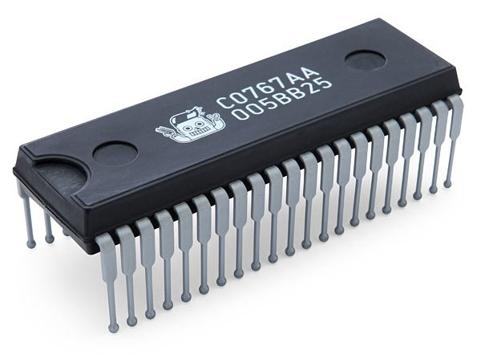

# Semana 2 - Electrónica y movimiento

En esta semana se hablara sobre los conceptos basicos de la electronica y el movimiento. A continuacion se muestra una lista de los temas que se discutiran en la sesion:

- **Componentes electronicos y su simbología:** Exploraremos los distintos componentes electronicos que existen e identificaremos la simbologia que representan cada uno en los diagramas de circuitos.

- **Diagramas de circuitos:** Aprenderemos cómo representar visualmente las conexiones eléctricas y los componentes en diagramas de circuitos.

- **Fundamentos de la electricidad:** Conceptos eléctricos básicos como voltaje, corriente, resistencia, etc.

- **Electrónica analógica y digital:** Exploraremos las diferencias entre los sistemas electrónicos analógicos y digitales, y cómo cada uno aborda el procesamiento de señales.

- **Sensores y actuadores:** Conoceremos como los sensores leen información del entorno y cómo los actuadores convierten señales eléctricas en acciones físicas, impulsando la automatización y el control.

- **Motores y control de movimiento:** Aprenderemos cómo funcionan los motores eléctricos y cómo se controla su movimiento en una variedad de aplicaciones, desde robótica hasta sistemas industriales.

- **Microcontroladores:** Descubriremos los microcontroladores, pequeños dispositivos con capacidad de procesamiento, memoria y entrada/salida, que actúan como cerebros en sistemas electrónicos.

## Simbologia Electronica

A continuacion se muestra una tabla con los componentes electronicos principales y su simbologia respectiva:

| **Nombre**                     | **Simbologia**                                                    | **Imagen**                         |
| ------------------------------ | ----------------------------------------------------------------- | ---------------------------------- |
| Resistencia / Resistor         |   |  |
| Bobina / Inductor              |                                    |  |
| Condensador / Capacitor        |                                 |  |
| Interruptor                    |                               |  |
| Diodo                          |                                     |  |
| Circuito Integrado / CI / Chip |                                        |  |
| Amplificador Operacional       |                                        |  |
| Transistor                     |                                 |  |

> [!NOTE]
> Para ver un listado mas a detalle de cada componente y su simbologia [visite el siguiente link.](https://www.simbologia-electronica.com/simbologia-electrica-electronica/simbolos-electricos-electronicos-basicos.htm)

## Diagramas de circuitos

A continuacion se muestran los diagramas de circuitos que existen, se incluye una breve descripcion asi como un ejemplo de lo que podemos encontrar.

### Circuitos logicos

Un Circuito Lógico es aquel que maneja la información en forma de “1” y “0”, dos niveles lógicos de voltaje fijos. “1” nivel alto o “high” y “0” nivel bajo o “low”. Puede ser cualquier circuito que se comporte de acuerdo con un conjunto de reglas lógicas.

### Circuitos electricos

Un circuito eléctrico es el conjunto de elementos eléctricos conectados entre sí que permiten generar, transportar y utilizar la energía eléctrica con la finalidad de transformarla en otro tipo de energía.

### Circuitos electronicos

Un circuito electrónico consiste en una estructura de placas formadas por materiales semiconductores, materiales activos y pasivos, cuyo funcionamiento es crear un recorrido completo por el cual pueda viajar la corriente. Depende del flujo de electrones para la generación, transmisión, recepción y almacenamiento de información.

> [!IMPORTANT]
> Con un **circuito eléctrico no es posible enviar información**. Con **un circuito electrónico se envía información** de un lugar a otro, gracias a su característica de poder controlar el flujo de la corriente.
